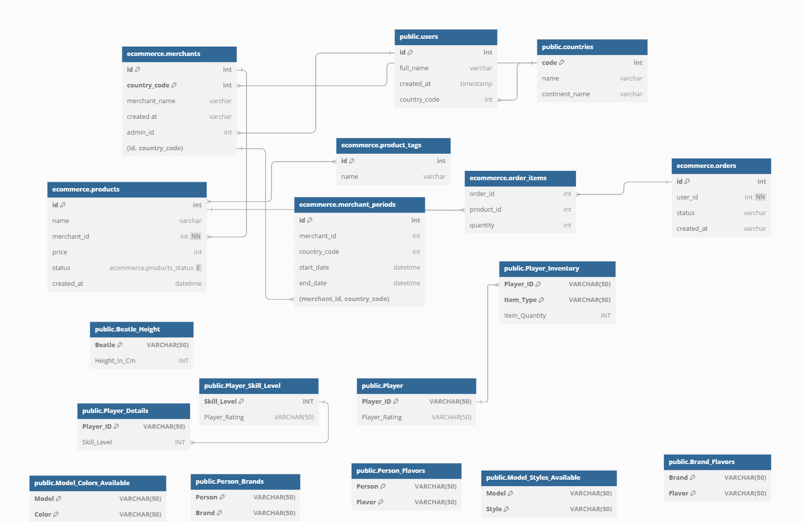
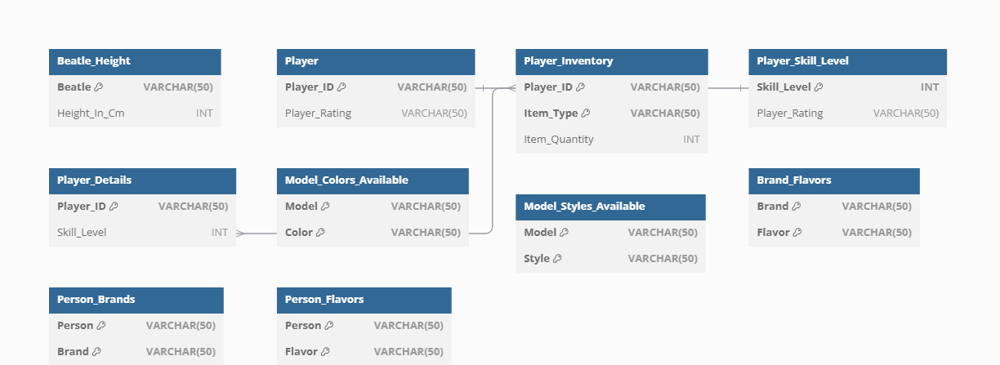

# Database Normalization ERD

This diagram illustrates the normalization process for relational databases, from First Normal Form (1NF) to Fifth Normal Form (5NF). Each section represents a stage in normalization, showcasing the structure of tables to avoid redundancy and anomalies.

